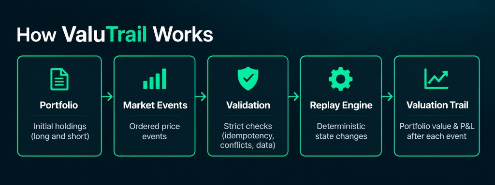

# ValuTrail

<p align="center">
  
</p>

<p align="center">
  <strong>Deterministic portfolio valuation and market-event replay in Java.</strong>
</p>

<p align="center">
  Reconstruct how ordered market price events change portfolio value and P&amp;L,
  with an emphasis on reproducibility, validation, and traceability.
</p>

<p align="center">
  <a href="https://github.com/mtk7zt/ValuTrail/actions/workflows/ci.yml"></a>
  
  
  
</p>

> **Current State**: The repository contains the tested Java 25 foundation, in-memory domain records (`Position`, `PriceEvent`, `ReplayResult`, `Scenario`, `ScenarioResult`), `ReplayEngine` (historical replay and read-only scenario evaluation), strict unquoted CSV parsing (`CsvParser`), and the file-driven CLI entrypoint (`Main`). All six fixture prices match StatMuse's displayed daily `CLOSE` table.

## How ValuTrail Works

<p align="center">
  
</p>

ValuTrail begins with an initial signed portfolio and processes ordered market-price events. Each event is validated before accepted state changes are applied, producing a deterministic trail of portfolio marked value and cumulative P&L.

## Prerequisites

- **Java Development Kit (JDK)**: Java 25+ (configured with `--release 25`)
- **Apache Maven**: 3.8+
- **Git**: 2.x+

## Verified Commands

### Build & Test
Compile the project and run the automated test suite (verifying replay engine logic, CSV parsing, and arithmetic against fixture inputs):
```bash
mvn -B test
```

### Build Verification
The repository includes a GitHub Actions workflow (`.github/workflows/ci.yml`) configured to run `mvn -B clean test` on pushes and pull requests to `main`.
- **What CI checks**: Automated compilation, syntax/schema and CSV parsing validation, and JUnit test suite execution against local fixture files.
- **What CI does not check**: CI does not verify the truth or market accuracy of historical prices against external exchanges, nor does it test live market feeds or uncommitted local files. Passing CI verifies only that the codebase compiles and passes test assertions in the build environment. CI status will be reported by GitHub once the workflow has run on GitHub Actions.

### Run Application Entrypoint

#### Two-File Historical Replay
Execute the file-driven replay entrypoint `dev.esosa.risk.Main` via Maven by passing the positions file first and prices file second:
```bash
mvn compile exec:java "-Dexec.args=examples/positions.csv examples/prices.csv"
```
Or in quiet mode (suppressing Maven lifecycle logs):
```bash
mvn -q compile exec:java "-Dexec.args=examples/positions.csv examples/prices.csv"
```
Expected output:
```text
Baseline: 751.70
1 e1 2024-08-29 AAPL 784.40 +32.70
2 e2 2024-08-29 WMT 777.80 +26.10
3 e3 2024-08-30 AAPL 770.00 +18.30
4 e4 2024-08-30 WMT 754.00 +2.30
```

#### Three-File Replay with Scenario Evaluation
Execute replay followed by what-if scenario evaluation by supplying an optional third argument:
```bash
mvn compile exec:java "-Dexec.args=examples/positions.csv examples/prices.csv examples/scenario.csv"
```
Or in quiet mode:
```bash
mvn -q compile exec:java "-Dexec.args=examples/positions.csv examples/prices.csv examples/scenario.csv"
```
Expected output:
```text
Baseline: 751.70
1 e1 2024-08-29 AAPL 784.40 +32.70
2 e2 2024-08-29 WMT 777.80 +26.10
3 e3 2024-08-30 AAPL 770.00 +18.30
4 e4 2024-08-30 WMT 754.00 +2.30
Scenario: Tech Surge
Base Marked Value: 754.00
Scenario Prices: AAPL=238.46, WMT=75.85
Scenario Marked Value: 867.60
Change: +113.60
```

## Replay Example Contract & Calculation Model

The first functional release replays ordered price events against an initial synthetic signed portfolio. Example files are in [`examples/`](examples/).

### Example Data Files

#### 1. Initial Holdings: [`examples/positions.csv`](examples/positions.csv)
Defines starting holdings and baseline mark prices at the initial valuation date.

```csv
symbol,quantity,baseline_price
AAPL,10,224.61
WMT,-20,74.72
```

- `symbol`: Equity ticker symbol.
- `quantity`: Signed share quantity held (+10 long AAPL, -20 short WMT). I chose these illustrative quantities to test a mixed long/short portfolio with different position sizes.
- `baseline_price`: Starting USD price per share as of 2024-08-28.

#### 2. Ordered Price Events: [`examples/prices.csv`](examples/prices.csv)
Defines the sequence of incoming market price updates to be replayed in order.

```csv
eventId,sequence,date,symbol,price
e1,1,2024-08-29,AAPL,227.88
e2,2,2024-08-29,WMT,75.05
e3,3,2024-08-30,AAPL,227.10
e4,4,2024-08-30,WMT,75.85
```

- `eventId`: Stable identifier (`e1`–`e4`).
- `sequence`: Replay processing order (`1`–`4`). I use sequence to define an unambiguous processing order when events share a trading date; it is not a claim about intraday market arrival order.
- `date`: Calendar trading date.
- `symbol`: Ticker symbol of the asset being updated.
- `price`: USD reference price.

#### 3. Scenario Definition: [`examples/scenario.csv`](examples/scenario.csv)
Defines a named hypothetical price shock to evaluate against the portfolio after replay.

```csv
scenario,symbol,percentage_change
Tech Surge,AAPL,0.05
```

- `scenario`: Unique scenario identifier/name (`Tech Surge`). All rows in the scenario file must share the same scenario name.
- `symbol`: Portfolio equity ticker symbol to shock (`AAPL`). Every symbol in the scenario must exist in the portfolio.
- `percentage_change`: Price shift expressed as a decimal fraction (`0.05` represents +5%). Must be strictly greater than `-1.0` (-100%).
- Symbols omitted from the scenario file (such as `WMT`) retain their current marked prices ($75.85).

> **Supported CSV Format & Validation**: The file reader accepts plain, unquoted UTF-8 comma-delimited rows with the exact headers shown above (`symbol,quantity,baseline_price`, `eventId,sequence,date,symbol,price`, and `scenario,symbol,percentage_change`). Quotation marks (`"`) and quoted or multiline fields are unsupported; rows containing quotation marks, blank values, or unexpected column counts are rejected immediately with an error identifying the file and row number. Duplicate position symbols and duplicate scenario symbols are rejected. Unknown scenario symbols and shifts $\le -1.0$ are rejected with file and row references before any scenario output is generated.

> **Data Provenance & Source Review**: On 2026-09-15, I checked and updated the historical fixture prices against historical tables on StatMuse Money. All six fixture prices match the values displayed in StatMuse's `CLOSE` column for August 28, 29, and 30, 2024 (without claiming a price convention StatMuse has not defined). The share quantities (+10 AAPL, -20 WMT) in `positions.csv` and the price shock (+5% AAPL) in `scenario.csv` are user-chosen illustrative synthetic inputs, not sourced market observations. See [`docs/DATA-PROVENANCE.md`](docs/DATA-PROVENANCE.md) for full provenance details.

### Valuation Rules & Reference Results

- **Replay Rule**: An incoming price event updates **only its own symbol’s latest price**. All other portfolio symbols retain their most recently observed price (or baseline price).
- **Marked-Value Model**: Position Value = $\text{quantity} \times \text{latest\_price}$; Portfolio Value = $\sum \text{Position Value}$; Cumulative P&L = $\text{Current Value} - \text{Baseline Value}$.
- **State Integrity & Execution Model**: Rejected events leave engine state unchanged. The engine currently processes events in a single thread.
- **Accounting Note**: This signed sum is a **simplified marked-value test**, not a complete account balance for a real short sale (which requires cash collateral, borrow fees, and separate short liability tracking). Detailed step-by-step arithmetic is documented in [`docs/EXAMPLE-CALCULATION.md`](docs/EXAMPLE-CALCULATION.md).

| Step | Date | Trigger Event | AAPL Price | WMT Price | Marked Value (USD) | Cumulative P&L (USD) |
|---|---|---|---|---|---|---|
| **Baseline (T0)** | 2024-08-28 | Initial Holdings | $224.61 | $74.72 | $751.70 | $0.00 |
| **Event `e1`** (seq 1) | 2024-08-29 | AAPL @ 227.88 | $227.88 | $74.72 | $784.40 | +$32.70 |
| **Event `e2`** (seq 2) | 2024-08-29 | WMT @ 75.05 | $227.88 | $75.05 | $777.80 | +$26.10 |
| **Event `e3`** (seq 3) | 2024-08-30 | AAPL @ 227.10 | $227.10 | $75.05 | $770.00 | +$18.30 |
| **Event `e4`** (seq 4) | 2024-08-30 | WMT @ 75.85 | $227.10 | $75.85 | $754.00 | +$2.30 |

## Scenario Evaluation (What-If Analysis)

ValuTrail supports evaluating hypothetical price shocks against the portfolio's current holdings without advancing the historical sequence or altering engine state.

> **Scope & Interpretation**: A scenario marked-value change is an instantaneous, static hypothetical revaluation based on user-specified percentage shifts. It is an arithmetic valuation test, not a price forecast or complete measure of market risk (it does not model liquidity, volatility, correlations, execution costs, or portfolio risk factors).

### How It Works

1. **Supply a Named Scenario**: Define a `Scenario` with a name and percentage price changes for selected symbols using `BigDecimal` decimal fractions (for example, `0.05` for +5% and `-0.03` for -3%). Symbols omitted from the scenario keep their current marked prices.
2. **Read-Only Valuation**: Calling `engine.evaluateScenario(scenario)` calculates the hypothetical scenario marked value, its change from the current portfolio value (`scenarioValue - baseValue`), and the effective scenario prices for all symbols. Internal engine state (`latestPrices`, `acceptedEvents`, `lastAcceptedSequence`) is not modified, so running the same scenario twice yields the identical result.
3. **Explicit Rounding Policy**: Shocked prices are calculated as `currentPrice * (1 + shift)` and rounded to 2 decimal places using `RoundingMode.HALF_UP` before computing position market values. This ensures that reported prices are auditable currency values and that position values match the displayed marks.
4. **Validation Rules**:
   - Every symbol in the scenario must exist in the portfolio; unknown symbols throw `IllegalArgumentException`.
   - Percentage shifts must be strictly greater than `-1.0` (-100%); drops of 100% or more are rejected because market prices must remain strictly positive.
   - Blank scenario names and null shifts throw exceptions.

### Example

```java
// Define a scenario that shocks AAPL by +10% and WMT by -5%
Scenario exampleScenario = new Scenario("Tech Rally / Retail Dip", Map.of(
        "AAPL", new BigDecimal("0.10"),
        "WMT", new BigDecimal("-0.05")
));

// Evaluate against current engine state (read-only)
ScenarioResult result = engine.evaluateScenario(exampleScenario);

System.out.println("Scenario: " + result.scenarioName());
System.out.println("Base Value: " + result.baseValue());         // e.g. 751.70
System.out.println("Scenario Value: " + result.scenarioValue()); // 1051.10
System.out.println("Value Change: " + result.valueChange());     // +299.40
```

## Next Steps

- **Output Formatting & Export**: Provide options for JSON or CSV report output formats alongside standard CLI stdout lines.
- **Performance & Large Feeds**: Evaluate streaming event processing for large datasets while preserving single-threaded replay determinism.

